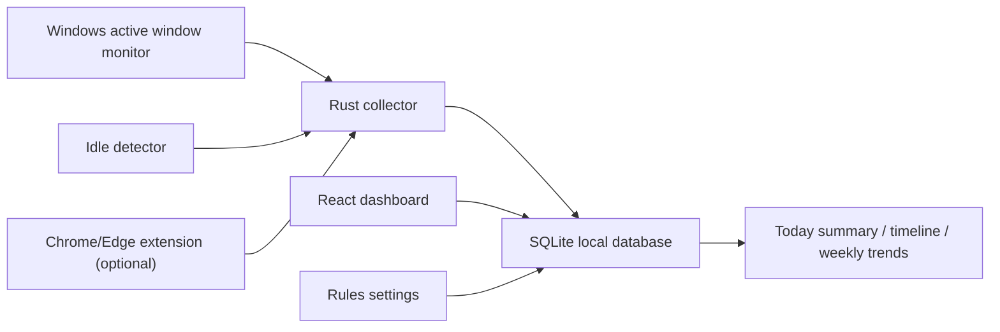

# Time Manager Windows MVP Design

Date: 2026-06-17
Status: Approved for planning

## Objective

Build a Windows-first desktop app that automatically records active computer usage and helps the user understand productive, unproductive, neutral, idle, and uncategorized time. The app should feel closer to a colorful personal analytics tool than a plain timer: charts, tables, and a rich day timeline are part of the core product.

The app should launch on Windows first, while keeping a path open for a future macOS release.

## Product Scope

The MVP focuses on automatic recording and reporting.

Included:

- Record the currently active window, active application, window title, and idle periods.
- Detect browser domains accurately when an optional Chrome/Edge extension is installed.
- Fall back to process and window title detection when no browser extension is installed.
- Store data locally by default in SQLite.
- Classify activity as productive, unproductive, neutral, ignored, or uncategorized.
- Ship broad default classification presets for common domains, apps, and title keywords.
- Let the user add, edit, delete, and override classification rules.
- Show today's summary, day timeline, top apps/sites tables, uncategorized items, and weekly trends.
- Let the user pause tracking from the system tray.
- Export local data to JSON or CSV.

Excluded from MVP:

- Forced blocking or site/app lockout.
- Cloud sync.
- Team, admin, billing, or attendance workflows.
- Screenshot recording.
- Mobile apps.

## Recommended Stack

Use Tauri with React, TypeScript, Rust, and SQLite.

Reasons:

- Tauri supports Windows and macOS from one desktop-app architecture.
- Rust is a good fit for OS-level active window, idle detection, tray, and local data collection.
- React and TypeScript give a productive path for a polished analytics UI.
- SQLite keeps private activity data local and makes future sync/export work easier.

Alternatives considered:

- Electron: faster web-only ergonomics, but heavier runtime and still needs native modules for reliable OS tracking.
- .NET MAUI or WinUI/WPF: strong Windows-native access, but less smooth for shared web UI and future browser-extension-adjacent work.

References:

- Tauri: https://tauri.app/
- Tauri Windows prerequisites: https://v2.tauri.app/start/prerequisites/
- Electron: https://www.electronjs.org/
- .NET MAUI: https://learn.microsoft.com/en-us/dotnet/maui/
- ManicTime day view reference: https://docs.manictime.com/win-client/overview
- ManicTime tracking reference: https://docs.manictime.com/win-client/tracking

## Architecture

The Rust collector samples the current active window every few seconds. It tracks process name, window title, foreground status, timestamps, and idle status. When the browser extension is available, it provides active tab URL/domain data to improve classification. When it is unavailable, the app still records useful process and title-based activity.

The UI reads from SQLite through Tauri commands. It should not directly own collection logic. Collection, classification, storage, and reporting should remain separate so macOS-specific collectors can be added later.

## Components

### Activity Monitor

Runs in the Rust backend. It collects the foreground application, active window title, process path or process name, and start/end timestamps for each activity segment.

It merges consecutive samples into sessions when the same app/domain/title remains active. It closes the current session when focus changes, the user becomes idle, tracking is paused, or the app exits.

### Idle Detector

Detects keyboard and mouse inactivity. The default idle threshold should be configurable, with a sensible default such as 5 minutes.

Idle time is recorded separately from productive and unproductive time. By default, returned idle periods stay classified as idle/away time. The user can later ignore or reclassify those periods from the timeline or detail table.

### Browser URL Bridge

An optional Chrome/Edge extension reports the active tab URL or domain to the desktop app.

Privacy default:

- Store domain and title by default.
- Store full URL only when the user explicitly enables it.
- Do not store query strings unless full URL storage is enabled.

When the extension is missing or disconnected, the app continues with process and title-based classification and shows a low-accuracy indicator in settings.

### Classification Engine

Applies rules in priority order:

1. User custom rules.
2. Built-in default presets.
3. Uncategorized fallback.

Within each source, more specific matches win:

1. Exact URL or full URL pattern, only if enabled.
2. Exact domain or subdomain.
3. Parent domain.
4. Application name.
5. Window title keyword.
6. Advanced pattern.

Categories:

- Productive
- Unproductive
- Neutral
- Ignored
- Uncategorized

The engine stores raw session evidence separately from classification results so past data can be reclassified after rules change.

### Local Data Store

SQLite stores:

- Raw activity sessions.
- Browser domain/URL evidence.
- Classification rules.
- Rule match results.
- User settings.
- Daily and weekly aggregate caches.

Raw sessions should remain the source of truth. Aggregates are a performance layer that can be rebuilt.

### Dashboard UI

The UI should prioritize dense, colorful, practical analytics. It should feel inspired by tools such as ManicTime's day view, where timelines, details, and summaries work together, while putting productivity classification more front and center.

Primary views:

- Today summary.
- Day timeline.
- Weekly trends.
- Rules settings.
- Uncategorized review.
- Export/backup.

### Tray Controller

The app should run quietly in the background and expose key controls from the Windows system tray:

- Open dashboard.
- Pause for 15 minutes.
- Pause for 1 hour.
- Pause until tomorrow.
- Resume tracking.
- Quit.

## Default Classification Presets

Built-in presets should be broad enough for the product to feel useful immediately. They must be editable by the user.

### Productive Domains

- `chatgpt.com`
- `chat.openai.com`
- `openai.com`
- `platform.openai.com`
- `claude.ai`
- `github.com`
- `gitlab.com`
- `stackoverflow.com`
- `developer.mozilla.org`
- `learn.microsoft.com`
- `docs.rs`
- `docs.python.org`
- `npmjs.com`
- `pypi.org`
- `docs.google.com`
- `notion.so`
- `figma.com`
- `linear.app`
- `jira.com`
- `atlassian.net`

### Unproductive Domains

- `youtube.com`
- `instagram.com`
- `tiktok.com`
- `x.com`
- `twitter.com`
- `facebook.com`
- `netflix.com`
- `disneyplus.com`
- `twitch.tv`
- `chzzk.naver.com`
- `sooplive.co.kr`
- `webtoon.naver.com`
- `comic.naver.com`

### Neutral or Context-Dependent Domains

- `google.com`
- `naver.com`
- `bing.com`
- `gmail.com`
- `mail.google.com`
- `drive.google.com`
- `reddit.com`
- `discord.com`
- `slack.com`
- `teams.microsoft.com`
- `calendar.google.com`
- `shopping.naver.com`
- `coupang.com`

Neutral domains can still have productive or unproductive subdomain overrides. For example, `chzzk.naver.com` is unproductive even though `naver.com` is neutral. `docs.google.com` is productive even though `google.com` is neutral.

### Productive Apps and Keywords

- Visual Studio Code
- Cursor
- JetBrains IDEs
- Visual Studio
- Windows Terminal
- PowerShell
- GitHub Desktop
- Docker Desktop
- Notion
- Figma
- Obsidian
- Excel, PowerPoint, Word
- Codex
- ChatGPT
- Claude
- GitHub
- Stack Overflow

### Neutral Apps

- Chrome
- Edge
- Firefox
- Windows Explorer
- KakaoTalk
- Slack
- Microsoft Teams
- Mail clients

Browsers are neutral by app name because the domain should decide classification whenever possible.

### Unproductive Apps and Keywords

- Steam
- Epic Games Launcher
- Riot Client
- Battle.net
- Netflix
- YouTube
- Instagram
- TikTok
- Shorts
- Reels
- Webtoon
- Chzzk
- Twitch
- Soop

These defaults should be visible as presets in settings, not hidden constants.

## Reporting and Visual Design

The dashboard must include charts and tables from the first usable version.

### Today Summary

Show:

- Total tracked time.
- Productive time.
- Unproductive time.
- Neutral time.
- Idle time.
- Uncategorized time.
- Productivity ratio.

Visuals:

- Donut chart for category share.
- Stacked horizontal bar for today's time distribution.
- Compact metric tiles for totals and ratios.

### Day Timeline

Show a horizontal day timeline with colorful segments.

Timeline modes:

- Productivity category timeline.
- Application timeline.
- Domain/site timeline.
- Idle/active timeline.

Interactions:

- Hover or click a segment to see app, domain, title, start time, end time, duration, and rule match.
- Click an uncategorized segment to add a rule.
- Filter by category, app, or domain.

ManicTime reference: its day view is organized around Timelines, Details, and Summary, and its application timeline gives each app its own color. This app should adopt that clarity while using productivity categories as a first-class layer.

Reference: https://docs.manictime.com/win-client/overview

### Tables

Tables are core UI, not secondary details.

Required tables:

- Top apps today.
- Top domains today.
- Uncategorized items.
- Rule list.
- Recent sessions.

Columns:

- Name.
- Category.
- Duration.
- Percent of tracked time.
- Last used.
- Matched rule.
- Actions.

Actions:

- Reclassify.
- Add rule.
- Ignore.
- View timeline segments.

### Weekly Trends

Show:

- Stacked bar chart by day for productive, unproductive, neutral, idle, and uncategorized time.
- Line chart for productivity ratio.
- Top movers table showing apps or domains that increased most compared with the previous period.

### Color System

Use a colorful but controlled palette:

- Productive: green/teal.
- Unproductive: coral/red.
- Neutral: blue/slate.
- Idle: amber.
- Uncategorized: violet.
- Ignored: gray.

Apps and domains can also receive stable unique colors for timeline differentiation. Category color must remain visible through labels, legends, or secondary markers so users can read both app identity and productivity status.

## Data Flow

1. Collector samples the active window.
2. Idle detector labels the sample as active or idle.
3. Browser bridge optionally attaches domain or URL evidence.
4. Session merger extends or closes the current activity session.
5. Classification engine applies user rules, then default rules.
6. Raw session and classification result are stored.
7. Aggregate cache updates for day/week views.
8. UI queries summary, timeline, table, and trend data.

When a rule changes:

1. Mark affected aggregate caches stale.
2. Re-run classification over raw sessions.
3. Rebuild daily and weekly aggregates.
4. Update UI with a "reclassifying" state if the operation takes noticeable time.

## Data Model

Initial tables:

- `activity_sessions`
- `classification_rules`
- `classification_results`
- `daily_aggregates`
- `settings`
- `browser_events`

`activity_sessions` fields:

- `id`
- `started_at`
- `ended_at`
- `duration_seconds`
- `source`
- `app_name`
- `process_name`
- `window_title`
- `domain`
- `url`
- `url_storage_mode`
- `is_idle`
- `created_at`

`classification_rules` fields:

- `id`
- `name`
- `rule_type`
- `pattern`
- `category`
- `priority`
- `is_builtin`
- `is_enabled`
- `created_at`
- `updated_at`

`classification_results` fields:

- `session_id`
- `rule_id`
- `category`
- `confidence`
- `classified_at`

## Error Handling

- If active window sampling fails, keep the app running and record a collector error event.
- If the browser bridge disconnects, keep tracking with lower accuracy and show the status in settings.
- If SQLite writes fail, retry briefly and surface a visible app status warning.
- If aggregate rebuild fails, keep raw sessions intact and allow a manual rebuild.
- If full URL storage is disabled, strip path and query before persistence.

## Privacy and User Control

Defaults should be privacy-preserving:

- Local-only storage.
- Domain-level browser storage.
- No screenshot recording.
- No cloud upload.
- Tray-based pause controls.
- Export controlled by the user.

The UI should make it obvious when tracking is active, paused, or in lower-accuracy browser mode.

## Testing Plan

Collector tests:

- Active window changes close and create sessions correctly.
- Idle state splits active sessions.
- Tracking pause stops recording.

Classification tests:

- User rules override built-in rules.
- Subdomain rules beat parent domain rules.
- Domain rules beat browser app-name rules.
- Uncategorized fallback works.
- Ignored sessions are excluded from productivity totals.

Reclassification tests:

- Editing a rule changes past aggregate results.
- Disabling a rule restores the next matching rule or uncategorized state.

Browser bridge tests:

- Domain-based classification is used when extension data exists.
- Title/process fallback is used when extension data is absent.
- Full URL storage respects the privacy setting.

UI tests:

- Empty data states render cleanly.
- Large datasets keep charts and tables usable.
- Today summary, timeline, weekly trends, and tables stay readable on common desktop window sizes.
- Uncategorized rows can create rules without leaving the report flow.

## Success Criteria

The MVP is successful when:

- The Windows app records active app/window usage and idle time in the background.
- The app works without a browser extension, using title/process fallback.
- The optional browser extension improves domain accuracy for Chrome/Edge.
- The dashboard shows colorful charts and tables for today summary, day timeline, top apps/sites, uncategorized items, and weekly trends.
- The user can customize broad default rules and add new domain, app, and title keyword rules.
- Rule changes can reclassify past data.
- All data is stored locally by default.
- The user can pause and resume tracking from the tray.

## Open Follow-Up for Implementation Planning

The next step is to write a concrete implementation plan with milestones:

1. Project scaffold and app shell.
2. SQLite schema and repository layer.
3. Windows active-window and idle collector.
4. Classification engine and default presets.
5. Dashboard charts and tables.
6. Rules management UI.
7. Optional browser extension bridge.
8. Packaging and verification.
