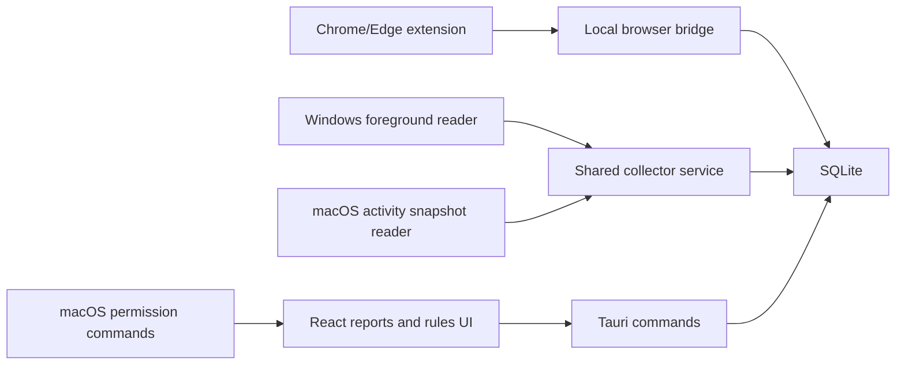

# FlowPilot macOS Collector Design

Date: 2026-06-19
Status: Approved for specification review

## Objective

Add a macOS version to the existing FlowPilot Tauri 2, React, and Rust codebase without breaking the Windows implementation. The macOS version should collect open application and window activity, keep browser reporting domain-based, explain required macOS permissions in Korean, preserve the existing reporting and rules workflows, and support local development plus unsigned `.app`/`.dmg` packaging.

## Existing Codebase Shape

The current app already has useful boundaries:

- `src-tauri/src/collector/active_window.rs` defines the active-window reader trait and the Windows implementation.
- `src-tauri/src/collector/service.rs` owns the sampling loop, session accumulator, pause checks, and persistence.
- `src-tauri/src/collector/session_merger.rs` owns pure sample merge rules.
- `src-tauri/src/browser_bridge.rs` receives browser-extension domain events through a local HTTP bridge.
- `src-tauri/src/storage` persists sessions, browser events, rules, and settings in SQLite.
- `src-tauri/src/domain` owns classification, presets, and activity DTOs.
- `src/api/activityApi.ts` isolates the frontend from Tauri command names.
- The React pages and components consume `ActivitySession` DTOs and can remain mostly unchanged if the DTO shape is preserved.

Windows-specific code is currently limited to `#[cfg(target_os = "windows")]` blocks in the collector and idle reader plus the Windows-only dependency block in `src-tauri/Cargo.toml`. This is a good foundation for adding a separate macOS collector.

## Product Semantics

FlowPilot reports should keep their current meaning: recorded time is wall-clock activity time, not the sum of every visible window. If four windows are visible for ten minutes, today's total should remain about ten minutes, not forty.

For macOS, visible window and running app information will be collected as supporting evidence, while persisted activity sessions continue to use one primary sample per sampling interval. This preserves Windows report semantics and avoids confusing daily/weekly totals.

## Scope

Included:

- Copy the Windows project into `/Users/biglol/Desktop/practice/FlowPilot_mac` as the macOS working copy.
- Add a platform-neutral collector interface that can represent one primary activity sample plus optional visible-window evidence.
- Keep the Windows collector behavior unchanged by adapting it to the new interface with a single primary sample.
- Add a macOS collector behind `#[cfg(target_os = "macos")]`.
- Collect app name, process name or bundle identifier where available, process id, window title where permitted, and visible/running state where available.
- Add macOS permission state commands and Korean UI copy for Accessibility and Screen Recording.
- Reuse the existing Chromium browser extension and local browser bridge for Chrome and Edge.
- Document Safari's separate Safari Web Extension path.
- Preserve daily/weekly reports, chart/table/timeline views, exclusion and classification rules, display names, auto-refresh, and SQLite persistence.
- Confirm tray/menu behavior remains available through Tauri's tray integration on macOS.
- Produce development-run instructions and unsigned `.app`/`.dmg` packaging instructions.
- Document Developer ID signing and notarization as a separate release step.

Excluded from this implementation pass:

- A full Safari Web Extension Xcode project.
- Cloud sync or cross-device sync.
- Screenshot capture or image storage.
- App Store distribution.
- Per-window parallel time totals.

## Recommended Architecture

The collector service should no longer assume that a platform reader can only return one foreground window. Instead, it should accept an activity snapshot. A snapshot contains:

- `primary`: the one `ActivitySample` used for persisted session duration and report totals.
- `visible_windows`: zero or more window/app observations used for evidence and future detail views.
- `permission_state`: optional platform permission hints.

For the first macOS implementation, only `primary` is converted into `ActivitySession` rows. Visible window observations are stored in a separate evidence table for auditability and future detail views, but they must not inflate report totals.

## Rust Backend Design

### Collector Traits

Replace or extend the current `ActiveWindowReader` boundary with a platform-neutral reader:

- `ActivitySnapshotReader::read_snapshot() -> anyhow::Result<ActivitySnapshot>`
- `ActivitySnapshot.primary: ActivitySample`
- `ActivitySnapshot.visible_windows: Vec<WindowObservation>`

`ActivitySample` remains the persisted-session input and should keep its current fields: observed time, app name, process name, window title, optional domain, and idle flag.

`WindowObservation` should be pure data:

- observed time
- app name
- process name
- process id, if available
- bundle identifier, if available
- window title, if available
- whether macOS reported the window as visible/on-screen
- whether this observation was selected as primary

The existing `ActivitySessionAccumulator` should stay responsible for merging only the primary sample. Existing tests around stable IDs, session closing, and merge behavior should continue to pass.

### Windows Adapter

The Windows reader keeps using `GetForegroundWindow()`, `GetWindowTextW`, `GetWindowThreadProcessId`, and `QueryFullProcessImageNameW`. It should return an `ActivitySnapshot` with one primary sample and one primary window observation. No Windows-visible-window enumeration is needed for this macOS task.

### macOS Collector

The macOS implementation should live in a separate module compiled only on macOS. It should avoid changing Windows dependencies or code paths.

Collection strategy:

1. Use AppKit `NSWorkspace` to enumerate running applications and obtain localized app names, bundle identifiers, process identifiers, activation policy, and active/frontmost state.
2. Use CoreGraphics window listing to identify on-screen or visible windows and associated process identifiers.
3. Use Accessibility APIs to retrieve focused app/window details and window titles when permission is granted.
4. Choose the primary sample from the frontmost app/window when available. If focused-window detail is unavailable, fall back to the frontmost running app. If that is unavailable, fall back to the first visible non-FlowPilot application.

Expected privacy behavior:

- If Accessibility is not granted, titles may be blank or less accurate.
- If Screen Recording is not granted, window listing/title metadata may be limited.
- The app should still run and report the highest-confidence app/process data it can collect.

The macOS reader should not record screenshots, pixels, or full screen content.

### Permissions

Add a Rust type exposed through a Tauri command such as `get_macos_permission_status`:

- `platform`: `macos` or another platform marker
- `accessibilityGranted`: boolean
- `screenRecordingGranted`: boolean
- `accessibilityRequiredReason`: Korean user-facing reason
- `screenRecordingRequiredReason`: Korean user-facing reason
- `canPromptAccessibility`: boolean where supported
- `canPromptScreenRecording`: boolean where supported

Use official macOS permission APIs:

- Accessibility trust can be checked with `AXIsProcessTrustedWithOptions`.
- Screen Recording can be checked with `CGPreflightScreenCaptureAccess` and requested with `CGRequestScreenCaptureAccess`.

The UI should not claim that permission is enabled until the backend reports it. It should tell the user to open System Settings, grant the permission to FlowPilot, and restart the app if macOS requires it.

### Idle Detection

The existing Windows idle reader is Windows-only and is not wired into the current collector service. macOS idle detection is not included in this implementation pass. It should remain a separate follow-up so activity snapshot work does not mix with idle-threshold behavior.

## Browser Design

### Chrome and Edge

The existing Manifest V3 extension and local bridge should remain the preferred path for Chromium browsers:

- The extension reports active tab events.
- The desktop app receives events at `127.0.0.1:17321/browser-event`.
- The app stores domains only in this implementation and does not persist full URLs.
- Domain rules continue to classify browser activity before app/title fallback rules.

This path is portable to Chrome and Edge on macOS because it is browser-extension based rather than Windows-specific.

### Safari

Safari should be designed as a follow-up integration, not mixed into this collector pass. Apple documents Safari Web Extensions as a separate extension format packaged through an Xcode Safari Extension App, with native app messaging available between the extension and containing app.

Design decision:

- Document that Safari domain-level tracking requires a Safari Web Extension package or a separate macOS native messaging flow.
- Keep the current browser bridge payload shape (`domain`, optional `url`, `title`) so a future Safari extension can report into the same backend path.
- Until that extension exists, Safari activity is classified by app/window/title fallback, not domain.

## Frontend UX

Add a compact Korean permission notice when running in Tauri on macOS and either permission is missing.

Copy direction:

- Accessibility: "앱과 창 제목을 정확히 기록하려면 손쉬운 사용 권한이 필요합니다."
- Screen Recording: "열려 있는 창 목록과 제목을 확인하려면 화면 기록 권한이 필요할 수 있습니다. FlowPilot은 화면 이미지를 저장하지 않습니다."
- Action text: "시스템 설정 > 개인정보 보호 및 보안에서 FlowPilot을 허용한 뒤 앱을 다시 실행해 주세요."

The notice should be informative and not block access to existing reports. If permissions are missing, the app can still show lower-confidence activity data and the existing demo or persisted data.

The app name remains FlowPilot in `tauri.conf.json`, title, tray/menu labels, and UI branding.

## Data Persistence

Existing `activity_sessions` rows remain the source of truth for reports.

Add a separate `window_observations` table:

- id
- observed_at
- session_id nullable
- app_name
- process_name
- pid nullable
- bundle_identifier nullable
- window_title nullable
- is_visible
- is_primary
- created_at

This table must not drive report totals. Reports continue to read `activity_sessions`.

## Tests

Follow test-first implementation.

Rust tests:

- Snapshot-to-session accumulator preserves one wall-clock timeline even with multiple visible observations.
- Windows adapter returns a snapshot with exactly one primary observation in tests that can run on non-Windows through pure helper functions.
- macOS permission status mapping serializes to the expected camelCase DTO shape.
- macOS title/window fallback selection chooses frontmost app first, then visible non-FlowPilot app.
- Repository tests preserve existing session storage behavior after adding the evidence table.

TypeScript tests:

- Permission banner renders Korean Accessibility and Screen Recording guidance when permissions are missing.
- Permission banner is hidden when permissions are granted or when running outside macOS desktop runtime.
- Existing dashboard, rules, table, timeline, and browser-extension tests continue to pass.

Manual verification:

- `npm test`
- `npm test` in `browser-extension`
- `cargo test` in `src-tauri`
- `npm run build`
- `npm run tauri dev` on macOS
- `npm run tauri build -- --bundles app,dmg` or the Tauri v2 equivalent accepted by the installed CLI

Current local caveat: the initial environment did not have `node_modules`, `cargo`, `rustc`, or `tauri` on PATH. Implementation verification must install or expose those tools before claiming tests pass.

## Packaging

Development run:

1. Install Node dependencies in the root project.
2. Install browser-extension dependencies if working on the extension.
3. Install Rust and Tauri prerequisites for macOS.
4. Run `npm run tauri dev`.

Unsigned local packaging:

- Build app bundle and DMG through Tauri's macOS bundler.
- Keep `productName` as `FlowPilot`.
- Use the existing icon set, including `icons/icon.icns`.

Release signing and notarization:

- Developer ID signing is a separate release step.
- Direct macOS distribution outside the App Store requires notarization.
- Document required certificate, Apple Team ID, Apple ID or App Store Connect API credentials, Tauri signing/notarization environment variables, build command, and stapling behavior.

## References

- Apple `AXIsProcessTrustedWithOptions`: https://developer.apple.com/documentation/applicationservices/1459186-axisprocesstrustedwithoptions
- Apple Safari Web Extension native app messaging: https://developer.apple.com/documentation/safariservices/messaging-a-web-extension-s-native-app
- Apple Safari Web Extensions overview: https://developer.apple.com/documentation/safariservices/safari-web-extensions
- Tauri macOS code signing: https://v2.tauri.app/distribute/sign/macos/
- Tauri distribution overview: https://v2.tauri.app/distribute/
