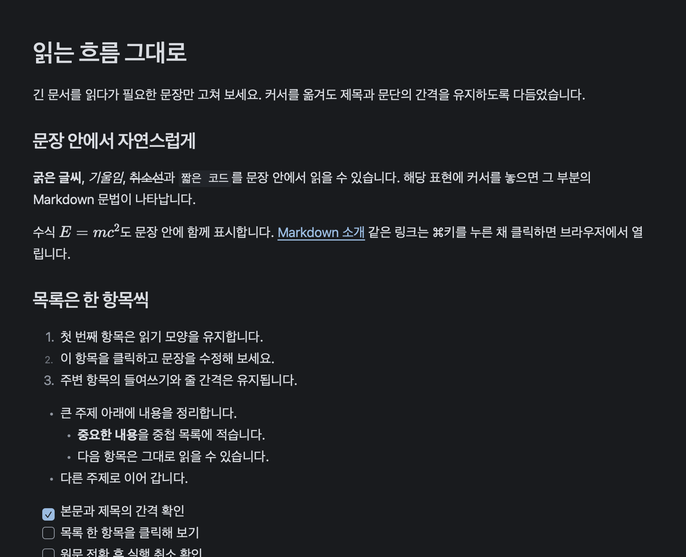

# Markdown Reader QA fixture

이 문서는 읽기 전용 Markdown 리더의 대표 콘텐츠입니다. 원본은 테스트 전후에 변경되지 않아야 합니다.

## 한국어 제목과 문단

안녕하세요. 한글 조합, UTF-8 문자, 이모지 📖 를 포함한 문단입니다.

## 목록과 체크리스트

- 첫 번째 항목
- 두 번째 항목
  - 중첩 항목

- [x] 완료된 확인
- [ ] 아직 확인하지 않은 항목

## 표

| 항목 | 값 | 상태 |
| --- | ---: | --- |
| 읽기 모드 | true | 준비 |
| 원본 수정 | false | 보호 |
| 언어 | 한국어 | 확인 |

## 코드

```swift
let message = "읽기 전용"
print(message)
```

인라인 코드 `openDocument(path)` 도 포함합니다.

## 수식

인라인 수식: $E = mc^2$

블록 수식:

$$
\sum_{i=1}^{n} i = \frac{n(n+1)}{2}
$$

## Mermaid


## 상대 링크와 이미지

[중첩 문서 열기](nestedfolder/relative-target.md)



## 원격 이미지 예시 (옵트인 확인용)


## HTML처럼 보이는 리터럴

다음 텍스트는 실행 대상이 아니라 표시용 리터럴입니다.

```html
<script>alert('should remain literal')</script>
```

끝.
