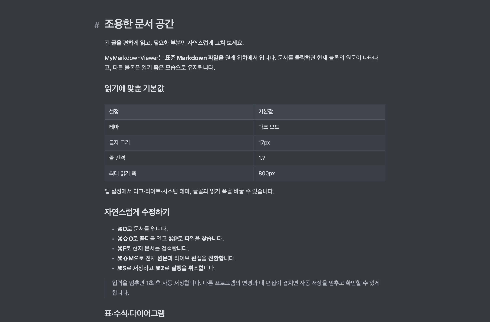

# Night 테마 추가

검증일: 2026-09-06. 사용자가 제공한 Night 이미지의 청회색 분위기를 바탕으로 별도 테마를 추가했다. Typora의 공식 테마 CSS를 그대로 복제한 것은 아니다.

## 선택과 색상

앱 설정의 테마에서 **다크 / Night · 청회색 / 라이트 / 시스템 설정 따르기**를 고른다. 기존 다크 색상과 첫 실행의 다크 기본값은 유지한다. 시스템 설정 따르기는 기존 다크·라이트를 사용하며 Night는 직접 선택한다. 선택은 재실행 후에도 유지한다.

| Night 영역 | 색상 |
|---|---|
| 본문·창 배경 | `#373B40` |
| 본문 글자 | `#DEE1E5` |
| 사이드바·상태 표시줄 | `#30343A` |
| 코드·표 머리글 | `#41464D` |
| 보조 글자 | `#B3B9C2` |
| 링크 | `#BAD6F2` |
| 선택 영역 | `#52677F` |

수식은 본문 색상을 따르고, Mermaid의 도형·선·라벨도 청회색 팔레트를 사용한다. macOS 컨트롤은 다크 외관을 사용한다. 저장된 테마를 HTML 응답과 시작 배경에 미리 적용하고, 편집기 초기화가 Night를 다크로 되돌리지 않도록 했다.

## 확인 결과

- Swift 10개, Markdown 4개, WebKit 20개: 총 34개 통과.
- Night에서 본문·코드·표·수식·Mermaid 색상 확인. 다크로 돌아오면 기존 배경과 Mermaid 색상 복원.
- 테마 전환 전후 원문·선택·리비전 동일. 전환 후 실행 취소로 편집 전 원문 복원.
- Night를 지정한 초기 HTML에서 편집기 시작 후에도 Night 유지. 실제 ZIP 설치본의 설정에서 Night 선택 → 완전 종료 → 재실행 후 선택 유지. 실제 문서 검사 배경 `rgb(55, 59, 64)`, 글자 `rgb(222, 225, 229)`, 네이티브 다크 외관 확인.
- 네이티브 창·사이드바·표를 화면에서 확인. 사용자 사이드바 너비 324pt 유지. 원래 읽던 문서의 SHA-256 동일.
- 최종 ZIP 설치본에서 자동 저장·BOM/CRLF·외부 변경/삭제·저장 중 입력·권한 오류·복구 검증 통과.
- Universal Release 빌드 완료. 새 폴더에 ZIP을 풀어 검증했으며, 설치본과 배포 앱 및 234개 웹 리소스의 해시 일치.

실행 확인 환경은 Apple Silicon / macOS 26.6.2다. Intel은 빌드 확인이며, 실제 두벌식 키보드 조합·외부 동기화 공급자·공증 범위는 [전체 검증 기록](Verification.md)을 따른다. 시작 색상은 초기 HTML 검증과 재실행 검사로 확인했으며, 모든 프레임을 고속 촬영해 판정한 결과는 아니다.

결과: [검증 JSON](verification-results.json). 원본 로그와 네이티브 화면은 `build/night-*.log`, `build/night-*.jpg`, `build/night-settings-after-relaunch.txt`에 있다. 앱 검증 보고서는 컨테이너의 `MyMarkdownViewer/QA/2026-09-06-night/app-qa.json`에 보관한다.

